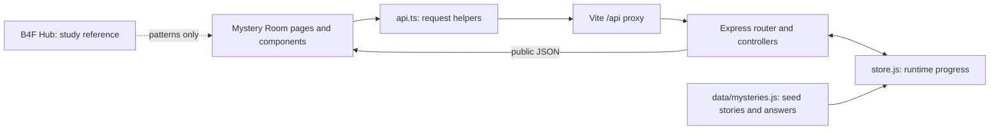
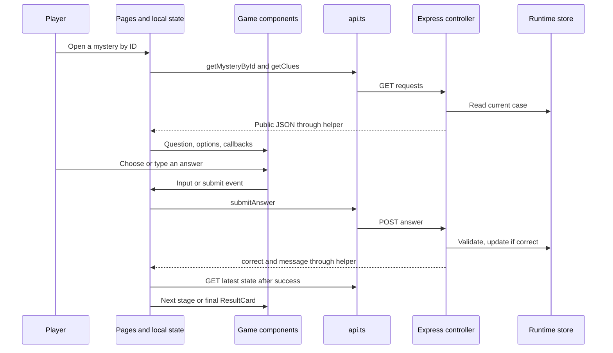

# Mystery Room — Team Presentation Guide

Based on the current provided code and local bootcamp references.

## Member guides

- [Shiam Ezzo](PRESENTATION_GUIDE_SHIAM.md)
- [Hassan Alloush](PRESENTATION_GUIDE_HASSAN.md)
- [Mulham Al Kasir (Molham)](PRESENTATION_GUIDE_MULHAM.md)
- [Adham Albasha](PRESENTATION_GUIDE_ADHAM.md)
- [Hamid Al Haj](PRESENTATION_GUIDE_HAMID.md)
- [Ali Mikdad](PRESENTATION_GUIDE_ALI.md)

# 1. Project Overview

Mystery Room — The Case Archive is a browser game with two Arabic stories and an
English interface. Players choose a case, read clues, submit answers, and solve
three stages to unlock an ending.

B4F Hub is the bootcamp teaching project for community posts and opportunities.
Mystery Room applies its programming patterns to a different product. It does not
call Hub's services or share its data. Removing Mystery Room would not break Hub.

| Part | Current implementation |
| --- | --- |
| Frontend: the browser interface | React, TypeScript for code checking, React Router for navigation |
| Development tool | Vite serves the client and forwards /api requests to Express |
| Backend: the request-handling program | JavaScript runs in Node.js; Express maps requests to functions |
| API: the communication contract | GET reads data, POST submits answers, PATCH requests hints |
| Data format | JSON: text representing objects, arrays, and simple values |
| Database and ORM | None. An ORM is a database-mapping tool; we do not use one |
| Authentication: identity checking | None. There are no accounts, passwords, tokens, or login sessions |
| Runtime storage | One in-memory server store, shared by connected browsers |
| Persistence | Browser refresh keeps server progress; server restart resets it |

HTTP is the request/response protocol between client and server. A proxy forwards
requests: during development, Vite forwards /api to localhost:3001. Normal npm start
in server does not serve the React production bundle.



## Team responsibilities and evidence

This is a guide to the **current integrated working tree**, including uncommitted
changes. Your latest role list defines presentation responsibilities; it does not
prove who wrote every line. Shared-file authorship is not invented.

| Member | Presentation area | Important limit |
| --- | --- | --- |
| Shiam Ezzo | Pages, routes, and layout | AppRouter, AboutPage, and separate Header files are absent |
| Hassan Alloush | API helpers, public types, and feedback | Current files are flat api.ts/types.ts, not the proposed folders |
| Mulham Al Kasir (Molham) | Existing page-local state and game flow | Earlier page work exists; assigned Context/Redux files are absent |
| Adham Albasha | Game components and results | Supplied components were merged and adapted |
| Hamid Al Haj | First mystery and shared backend overview | First-case ownership is user-confirmed; shared-file split is unclear |
| Ali Mikdad | Second mystery and validation behavior | Second-case ownership is user-confirmed; shared-file split is unclear |

Shiam and Mulham discuss overlapping pages from different angles: navigation versus
state and requests. This is a speaking plan, not an exclusive authorship assignment.
Later integration fixes, tests, and new reveal text are not automatically credited
to the original puzzle authors.

# 2. Team Member Sections

## Shiam Ezzo – Pages, Routes, and Layout

### 2.1 High-Level Summary

This area gives the player a clear route through the application. Home introduces the game, the archive lists cases, and the details page prepares the player to start. Game and result pages handle the playing and ending screens. Shared navigation and a footer keep the layout consistent.

### 2.2 Files They Worked On

These are the current files for this presentation area. Shared or comparison files
are not proof of individual authorship; missing assignments are noted below.

| File Path | Purpose | Key Functions/Classes/Components |
| --- | --- | --- |
| [client/src/main.tsx](<../client/src/main.tsx>) | Starts React and browser routing | createRoot, BrowserRouter |
| [client/src/App.tsx](<../client/src/App.tsx>) | Connects URLs to pages and shared layout | App, Routes, Route |
| [client/src/pages/HomePage.tsx](<../client/src/pages/HomePage.tsx>) | Introduces the product | HomePage |
| [client/src/pages/MysteriesPage.tsx](<../client/src/pages/MysteriesPage.tsx>) | Lists available cases | MysteriesPage |
| [client/src/pages/MysteryDetailsPage.tsx](<../client/src/pages/MysteryDetailsPage.tsx>) | Loads a selected case and offers the next action | MysteryDetailsPage |
| [client/src/pages/GamePage.tsx](<../client/src/pages/GamePage.tsx>) | Hosts the playing interface | GamePage, GameSession |
| [client/src/pages/ResultPage.tsx](<../client/src/pages/ResultPage.tsx>) | Loads completion or continue state | ResultPage |
| [client/src/pages/NotFoundPage.tsx](<../client/src/pages/NotFoundPage.tsx>) | Handles unmatched URLs | NotFoundPage |
| [client/src/components/Navbar.tsx](<../client/src/components/Navbar.tsx>) | Shared navigation | Navbar |
| [client/src/components/Footer.tsx](<../client/src/components/Footer.tsx>) | Shared footer | Footer |

### 2.3 Code Walkthrough

1. `main.tsx` wraps the application in one `BrowserRouter`.
2. `App.tsx` places the shared layout around `Routes`. The routes are `/`, `/mysteries`, `/mysteries/:id`, `/mysteries/:id/play`, and `/result/:id`; `*` is the fallback.
3. A `Link` changes the address without a full document reload. The `:id` part selects the case.
4. Detail, game, and result pages read that ID and ask Hassan's helpers for current server data. They show loading and error states while data is unavailable.
5. The game page composes Adham's small components. A solved game navigates to the result route.
6. The result page fetches its own data, so opening it directly or refreshing it does not depend on a previous page's memory. An unfinished case offers continuation.

A missing case such as `/mysteries/999` is an API error inside the detail page. An unknown route is handled by `NotFoundPage`; these are different failures.

### 2.4 Key Concepts to Learn

**Route.** A route maps a URL to a screen. A dynamic segment such as `:id` lets one page support multiple cases.

**Component.** A React component is a reusable function that describes part of the interface. Pages are components with responsibility for a whole screen.

**Client-side navigation.** React Router changes the displayed page inside the running application. Links retain ordinary navigation meaning without reloading the whole document.

**Route parameter.** A route parameter is text extracted from the URL. The backend later converts the mystery ID to a number and checks whether the case exists.

### 2.5 Connection to B4F Hub

The layout follows the page-and-route approach in [Hub App.tsx](<../../../B4F-BootCamp/b4f-cohort8-salamiyah-react-node-bootcamp-2026/client/src/App.tsx>). Both projects use React Router, but their routes and page data are independent. Without this area, Mystery Room would lose its screen navigation; Hub itself would continue working.

### 2.6 Connection to b4f-cohort8 Docs

- [Session 1 study guide](<../../../B4F-BootCamp/b4f-cohort8-salamiyah-react-node-bootcamp-2026/docs/Sessions/session-01/SESSION_GUIDE-EN.pdf>): Sections 4–7 explain BrowserRouter, pages, Link, and NavLink; sections 9–12 cover parameters, unavailable data, and programmatic navigation.
- [Session 5 study guide](<../../../B4F-BootCamp/b4f-cohort8-salamiyah-react-node-bootcamp-2026/docs/Sessions/session-05/SESSION_GUIDE-EN.pdf>): Sections 8–9 connect an ID route to a backend request. Our helper reports missing records with an error rather than Hub’s null return.

### 2.7 Presentation Talking Points

- Start: “I organize the screens and connect each address to the correct page.”
- Show `App.tsx`, then navigate Home → archive → details → play.
- Point out the ID in the address and refresh a result page.
- Explain the difference between an unknown URL and a missing mystery.
- Avoid presenting an About page or separate Header/AppRouter file as implemented.

### 2.8 Expected Questions & Answers

| Question | Simple Answer |
| --- | --- |
| Why one BrowserRouter? | It supplies one routing context to the application, matching the bootcamp structure. |
| Why separate pages? | Each screen has a clear purpose and is easier to follow. |
| Who checks the answer? | The server. Pages collect input and display its response. |
| Can results survive refresh? | Yes, while the same backend process remains running; the page fetches its progress. |

### 2.9 Glossary for This Member

| Term | Meaning |
| --- | --- |
| URL | The address of a page or resource. |
| Layout | The shared arrangement around page content. |
| Parameter | A value supplied through an address or function call. |
| Fallback route | The route used when no other pattern matches. |

**Scope and attribution:** TODO: need confirmation — the assigned `pages/AboutPage.tsx`, `router/AppRouter.tsx`, and `components/Header.tsx` are absent. Existing routing is in App.tsx. Shared pages overlap with Mulham’s presentation area.

## Hassan Alloush – API Helpers, Types, and Feedback

### 2.1 High-Level Summary

This area provides a clear connection between the interface and the server. Named helper functions hide repeated request details from the pages. TypeScript types describe the public data the client expects. Shared loading, error, and empty messages explain what is happening to the player.

### 2.2 Files They Worked On

These are the current files for this presentation area. Shared or comparison files
are not proof of individual authorship; missing assignments are noted below.

| File Path | Purpose | Key Functions/Classes/Components |
| --- | --- | --- |
| [client/src/api.ts](<../client/src/api.ts>) | Makes requests and converts failed responses into errors | apiRequest, getMysteries, getMysteryById, getClues, submitAnswer, requestHint |
| [client/src/types.ts](<../client/src/types.ts>) | Describes public request results | Mystery, Clue, AnswerResponse, HintResponse |
| [client/src/components/LoadingMessage.tsx](<../client/src/components/LoadingMessage.tsx>) | Announces loading | LoadingMessage |
| [client/src/components/ErrorMessage.tsx](<../client/src/components/ErrorMessage.tsx>) | Displays an error and optional retry action | ErrorMessage |
| [client/src/components/EmptyState.tsx](<../client/src/components/EmptyState.tsx>) | Explains an empty collection | EmptyState |

### 2.3 Code Walkthrough

1. A page calls a helper, such as `getMysteryById(id)`.
2. `apiRequest<T>` sends `fetch` to `/api/mysteries` plus the endpoint path. `T` is the expected TypeScript result type.
3. The helper checks `response.ok`. On failure it uses the server's error string when possible, otherwise a fallback, and throws an `Error`.
4. Successful JSON returns to the page. The page owns loading/error state and decides what to render.
5. `submitAnswer` sends POST with a JSON `{answer}` body. `requestHint` sends PATCH. IDs are escaped with `encodeURIComponent` when constructing paths.
6. `ErrorMessage` calls the retry function supplied by the page; it does not force a browser reload. Loading and error messages use accessible status/alert roles.

`Mystery` exposes current progress, available options, and hint counts, but not the accepted answer list. `reveal` is null before completion. A wrong answer is a successful HTTP response with `correct: false`, not a network exception.

### 2.4 Key Concepts to Learn

**API.** An API is the agreed way two parts of a program communicate. Here it consists of HTTP endpoints and JSON response shapes.

**Promise and await.** A Promise represents work that finishes later. `await` lets a function wait for a request result while the browser remains able to render.

**TypeScript type.** A type describes allowed data during development. It does not inspect the actual server JSON at runtime; `as T` is not validation.

**HTTP status.** A status code tells the client how a request was handled. The client must check it because fetch does not automatically throw for every 400 or 404 response.

### 2.5 Connection to B4F Hub

Compare [Hub API helpers](<../../../B4F-BootCamp/b4f-cohort8-salamiyah-react-node-bootcamp-2026/client/src/api.ts>) and [Hub types](<../../../B4F-BootCamp/b4f-cohort8-salamiyah-react-node-bootcamp-2026/client/src/types.ts>). Both centralize requests and data descriptions, and both have reusable feedback components. No Hub endpoint or type is imported by Mystery Room; without this layer our own pages lose their normal request/error path.

### 2.6 Connection to b4f-cohort8 Docs

- [Session 5 study guide](<../../../B4F-BootCamp/b4f-cohort8-salamiyah-react-node-bootcamp-2026/docs/Sessions/session-05/SESSION_GUIDE-EN.pdf>): Sections 5–9 trace a request, explain HTTP, and connect fetch to a real backend.
- [Session 6 study guide](<../../../B4F-BootCamp/b4f-cohort8-salamiyah-react-node-bootcamp-2026/docs/Sessions/session-06/SESSION_GUIDE-EN.pdf>): Sections 3–4 describe input validation and deliberate status codes. Backend checks remain necessary even when the client has types.

### 2.7 Presentation Talking Points

- Start: “Pages call named functions instead of repeating fetch details.”
- Trace `getMysteryById` from a page into `apiRequest`.
- Show `Mystery` and explain why private answers are absent.
- Demonstrate a missing ID and the retry interface.
- Do not say TypeScript validates network data or that every wrong answer is an HTTP error.

### 2.8 Expected Questions & Answers

| Question | Simple Answer |
| --- | --- |
| Why centralize requests? | The base path and error handling have one owner. |
| Does fetch throw on 404? | Not automatically; apiRequest checks response.ok. |
| Why use encodeURIComponent? | It safely places the ID text into a URL path. |
| Are the proposed api/types folders present? | No. This implementation uses the flat files api.ts and types.ts. |

### 2.9 Glossary for This Member

| Term | Meaning |
| --- | --- |
| JSON | A text format for structured data. |
| Endpoint | An API address with a supported method. |
| Generic type | A type parameter such as T, supplied for a particular use. |
| Callback | A function passed to another component to run later. |

**Scope and attribution:** TODO: need confirmation — the proposed split into api/client.ts, api/mysteryApi.ts and four types files is not present. Explain the current flat structure without claiming those files exist.

## Mulham Al Kasir (Molham) – Existing Page State and Game Flow

### 2.1 High-Level Summary

The existing page code manages what the player is currently doing and seeing. It tracks selected input, loading, feedback, hint visibility, and request progress. The server remains responsible for solved stages and hint counts. This guide explains that existing implementation; the proposed Theme/Language Context and Redux game store are not present.

### 2.2 Files They Worked On

These are the current files for this presentation area. Shared or comparison files
are not proof of individual authorship; missing assignments are noted below.

| File Path | Purpose | Key Functions/Classes/Components |
| --- | --- | --- |
| [client/src/pages/MysteriesPage.tsx](<../client/src/pages/MysteriesPage.tsx>) | Loads the archive and manages retry state | MysteriesPage, useState, useEffect |
| [client/src/pages/MysteryDetailsPage.tsx](<../client/src/pages/MysteryDetailsPage.tsx>) | Loads a case when its ID changes | MysteryDetailsPage |
| [client/src/pages/GamePage.tsx](<../client/src/pages/GamePage.tsx>) | Coordinates input, requests, and feedback | GameSession, handleSubmit, handleHint, reloadGame |
| [client/src/pages/ResultPage.tsx](<../client/src/pages/ResultPage.tsx>) | Fetches result state independently | ResultPage |
| [docs/MOLHAM-PAGES.md](<MOLHAM-PAGES.md>) | Records the earlier page contribution and integration | Contribution notes |

### 2.3 Code Walkthrough

1. Pages keep temporary interface values in `useState`. Changing state makes React render the updated interface.
2. A load effect requests server data. Cleanup guards stop an outdated request from updating a page that is no longer relevant.
3. `GameSession` keeps the selected answer, hint, clue visibility, feedback, error, loading, and pending operation. The `busy` ref blocks overlapping answer/hint actions immediately.
4. `handleSubmit` prevents the form's normal navigation, checks its guards, and calls `submitAnswer`. The response supplies the message and correct/wrong feedback.
5. After a correct answer, a reload counter triggers a fresh read. The server decides whether to show another stage or navigate to the result.
6. `handleHint` requests the hint and updates its returned remaining count. Adham's components receive these values and callbacks through props.
7. `reloadGame` reads current state after an error. This matters if the server changed progress but the client never received the response: retrying a read is safer than blindly resending a mutation.

An `active` ref guards asynchronous handlers when the page unmounts. This does not cancel the server request and is not a server concurrency guarantee.

### 2.4 Key Concepts to Learn

**Local state.** Local state belongs to one component instance. It is suitable for a selected answer or an open clue panel; it disappears when that instance is replaced.

**Effect and cleanup.** An effect synchronizes a component with something outside rendering, such as an API request. Cleanup and ignore guards prevent stale responses from changing the current screen.

**Ref.** A ref stores a mutable value without causing a render. The busy ref gives event handlers an immediate overlap guard while state supplies visible loading feedback.

**Single source of truth.** The authoritative owner decides what a value means. Here the server owns progress; page state displays a fetched copy rather than independently deciding that the puzzle is solved.

**Context versus Redux.** Context makes a value available to descendants without passing it through every level. Redux manages shared application state through a store and actions; neither is implemented for this game.

### 2.5 Connection to B4F Hub

Hub demonstrates broader state tools in [NotificationContext](<../../../B4F-BootCamp/b4f-cohort8-salamiyah-react-node-bootcamp-2026/client/src/context/NotificationContext.tsx>) and [Redux store](<../../../B4F-BootCamp/b4f-cohort8-salamiyah-react-node-bootcamp-2026/client/src/store/store.ts>). Mystery Room currently follows the simpler page-local approach. Without its state coordination, our forms and recovery behavior fail; Hub’s store remains independent.

### 2.6 Connection to b4f-cohort8 Docs

- [Session 2 study guide](<../../../B4F-BootCamp/b4f-cohort8-salamiyah-react-node-bootcamp-2026/docs/Sessions/session-02/SESSION_GUIDE-EN.pdf>): Section 7 explains where Context does not belong, including page-local filters; section 9 discusses when passing props is enough.
- [Session 3 study guide](<../../../B4F-BootCamp/b4f-cohort8-salamiyah-react-node-bootcamp-2026/docs/Sessions/session-03/SESSION_GUIDE-EN.pdf>): Section 10 compares local state, props, Context, and Redux; section 11 distinguishes Redux from persistence.
- [Session 4 study guide](<../../../B4F-BootCamp/b4f-cohort8-salamiyah-react-node-bootcamp-2026/docs/Sessions/session-04/SESSION_GUIDE-EN.pdf>): Sections 4–8 cover typed hooks, selectors, cross-slice actions, and explicit persistence in Hub. These are comparison material, not implemented Mystery Room features.

### 2.7 Presentation Talking Points

- Start: “The page coordinates interactions, while the server owns game progress.”
- Show selected input and pending state in `GamePage.tsx`.
- Demonstrate a wrong answer, one hint, and a correct answer that loads the next stage.
- Explain cleanup guards and retry by reading current progress.
- Be clear that the assigned Context/Redux files are absent; do not present the Hub examples as your current game code.

### 2.8 Expected Questions & Answers

| Question | Simple Answer |
| --- | --- |
| Why no Redux here? | Current temporary state is managed within pages. The missing assigned store must be discussed honestly. |
| What happens on refresh? | Local input resets, and the page fetches progress from the still-running server. |
| Does the busy guard protect all players? | No. It only blocks overlapping actions in this mounted client view. |
| Why fetch again after success? | The next question, hint budget, and solved flag should come from the server. |

### 2.9 Glossary for This Member

| Term | Meaning |
| --- | --- |
| State | A value React remembers between renders. |
| Render | React calculating the interface from current values. |
| Effect | Code that synchronizes with an external system. |
| Ref | A persistent mutable value that does not trigger rendering. |
| Mutation | An operation that changes stored data. |

**Scope and attribution:** TODO: need confirmation — context/ThemeContext.tsx, context/LanguageContext.tsx and store/store.ts, hooks.ts, selectors.ts, gameSlice.ts are absent. Existing page contribution is documented, but these shared integrated files are not exclusively attributed to Mulham.

## Adham Albasha – Game Components and Result UI

### 2.1 High-Level Summary

This area breaks the game screen into smaller components with clear jobs. Components show the question, answer controls, hints, clues, feedback, progress, and final result. The game page supplies their data and handles requests. The supplied work has been adapted to the current project, so this guide describes the integrated versions.

### 2.2 Files They Worked On

These are the current files for this presentation area. Shared or comparison files
are not proof of individual authorship; missing assignments are noted below.

| File Path | Purpose | Key Functions/Classes/Components |
| --- | --- | --- |
| [client/src/components/MysteryCard.tsx](<../client/src/components/MysteryCard.tsx>) | Shows an archive case and its link | MysteryCard |
| [client/src/components/ProgressBar.tsx](<../client/src/components/ProgressBar.tsx>) | Displays bounded completed-stage progress | ProgressBar |
| [client/src/components/game/StageHeader.tsx](<../client/src/components/game/StageHeader.tsx>) | Displays case heading | StageHeader |
| [client/src/components/game/StageQuestion.tsx](<../client/src/components/game/StageQuestion.tsx>) | Labels the question inside a fieldset | StageQuestion |
| [client/src/components/game/AnswerOptions.tsx](<../client/src/components/game/AnswerOptions.tsx>) | Displays controlled radio choices | AnswerOptions |
| [client/src/components/game/SubmitAnswerButton.tsx](<../client/src/components/game/SubmitAnswerButton.tsx>) | Displays submission state | SubmitAnswerButton |
| [client/src/components/game/HintButton.tsx](<../client/src/components/game/HintButton.tsx>) | Triggers the supplied hint callback | HintButton |
| [client/src/components/game/HintBox.tsx](<../client/src/components/game/HintBox.tsx>) | Displays returned hint text | HintBox |
| [client/src/components/game/CluePanel.tsx](<../client/src/components/game/CluePanel.tsx>) | Toggles the clue region | CluePanel |
| [client/src/components/game/StageProgress.tsx](<../client/src/components/game/StageProgress.tsx>) | Displays the human-readable stage number | StageProgress |
| [client/src/components/game/GameStatus.tsx](<../client/src/components/game/GameStatus.tsx>) | Displays a game status message | GameStatus |
| [client/src/components/game/SuccessMessage.tsx](<../client/src/components/game/SuccessMessage.tsx>) | Announces positive feedback | SuccessMessage |
| [client/src/components/game/WrongAnswerMessage.tsx](<../client/src/components/game/WrongAnswerMessage.tsx>) | Announces wrong-answer feedback | WrongAnswerMessage |
| [client/src/components/game/ResultCard.tsx](<../client/src/components/game/ResultCard.tsx>) | Shows ending and completion statistics | ResultCard |

### 2.3 Code Walkthrough

1. `MysteriesPage` passes each case's explicit ID, title, description, stages, and solved flag to `MysteryCard`.
2. `GamePage` passes the current title and question to the heading components. `StageQuestion` renders a `legend`, the label for a group of form controls.
3. When options exist, `AnswerOptions` displays radio inputs. Its selected value comes from the page and its callback reports a new selection. For case 2, the text input lives directly in `GamePage`.
4. Buttons receive disabled/loading values. Their callbacks invoke page handlers; the display components do not check the secret answers.
5. Hint and clue components display server data. `CluePanel` receives its open state and toggle callback; all returned clues can be shown, not only completed-stage clues.
6. `StageProgress` adds one to the zero-based stage index for display. `ProgressBar` clamps its current value to a safe range and uses a native progress element.
7. The page uses `GameStatus` for idle/submitting status and the separate success/wrong components for actual server feedback. Do not claim every supported GameStatus branch is exercised by the page.
8. `ResultPage` supplies the solved reveal and statistics to `ResultCard`. The integrated card includes ending text and navigation, beyond the original statistics-only draft.

### 2.4 Key Concepts to Learn

**Props.** Props are values and functions a parent passes to a child component. They let the same visual component display different cases without owning the game rules.

**Controlled input.** A controlled input receives its value from React state. On change, it calls a handler so the parent can update that value.

**Composition.** Composition means building a screen by combining smaller components. The page coordinates behavior while each child has a focused display responsibility.

**Accessible semantics.** Semantic HTML describes what an element does, such as a button or a group of answers. Status roles and expanded-state attributes help assistive tools announce changes.

### 2.5 Connection to B4F Hub

Compare Hub’s [OpportunityCard](<../../../B4F-BootCamp/b4f-cohort8-salamiyah-react-node-bootcamp-2026/client/src/components/OpportunityCard.tsx>) and its shared feedback components. Both projects use typed component boundaries, though Hub’s card also uses shared-state hooks. Removing our game components would break their importing pages; it would not affect Hub.

### 2.6 Connection to b4f-cohort8 Docs

- [Session 1 study guide](<../../../B4F-BootCamp/b4f-cohort8-salamiyah-react-node-bootcamp-2026/docs/Sessions/session-01/SESSION_GUIDE-EN.pdf>): Section 5 distinguishes page-level screens from smaller components.
- [Session 2 study guide](<../../../B4F-BootCamp/b4f-cohort8-salamiyah-react-node-bootcamp-2026/docs/Sessions/session-02/SESSION_GUIDE-EN.pdf>): Sections 7 and 9 support keeping local concerns local and using props when enough.
- [Session 3 study guide](<../../../B4F-BootCamp/b4f-cohort8-salamiyah-react-node-bootcamp-2026/docs/Sessions/session-03/SESSION_GUIDE-EN.pdf>): Section 10 helps explain why reusable UI does not automatically require Redux.

### 2.7 Presentation Talking Points

- Start: “I split the playing screen into components that each do one clear job.”
- Show the game folder, then follow props into `AnswerOptions`.
- Demo a radio selection, clue toggle, hint, and result reveal.
- Mention the text-input branch is in the page and answer validation is on the server.
- Avoid showing the old draft as if its props still match the integrated application.

### 2.8 Expected Questions & Answers

| Question | Simple Answer |
| --- | --- |
| Where do these components fetch data? | They receive data from the pages; game request coordination is in GamePage. |
| Why is the first stage displayed as 1? | The server index starts at 0, so the display adds one. |
| Does ProgressBar decide completion? | No. It only displays supplied values. |
| Why split feedback components? | They keep message styling and accessibility consistent. |

### 2.9 Glossary for This Member

| Term | Meaning |
| --- | --- |
| Prop | An input passed into a component. |
| Radio input | A control that selects one option in a group. |
| Legend | A label describing a fieldset. |
| Composition | Combining smaller components into a screen. |
| aria-expanded | An attribute describing whether controlled content is open. |

**Scope and attribution:** The supplied Adham code was merged and adapted. Current card props, navigation, feedback integration, and reveal support must be explained from these files; later integration edits are not proof of original authorship.

## Hamid Al Haj – First Mystery and Shared Backend Structure

### 2.1 High-Level Summary

Hamid is responsible for the first puzzle according to the team assignment. Its three stages use multiple-choice answers and contribute to the shared game model. This presentation area also explains how the server is organized from startup to stored progress. The precise authorship split of shared backend files still needs confirmation.

### 2.2 Files They Worked On

These are the current files for this presentation area. Shared or comparison files
are not proof of individual authorship; missing assignments are noted below.

| File Path | Purpose | Key Functions/Classes/Components |
| --- | --- | --- |
| [server/data/mysteries.js](<../server/data/mysteries.js>) | Defines both seed cases; case 1 is Hamid’s assigned story | initialMysteries, case id 1 |
| [server/index.js](<../server/index.js>) | Starts the HTTP listener | dotenv.config, app.listen |
| [server/app.js](<../server/app.js>) | Composes parsing, routes, and error responses | app, express.json |
| [server/routes/mysteries.js](<../server/routes/mysteries.js>) | Maps methods and paths to handlers | router |
| [server/store.js](<../server/store.js>) | Owns runtime case data | mysteries, findMysteryById, resetMysteries |
| [server/controllers/mysteryController.js](<../server/controllers/mysteryController.js>) | Reads cases and processes game actions | toPublicMystery, getAllMysteries, getMysteryById, getCluesByMysteryId, submitAnswer, requestHint |

### 2.3 Code Walkthrough

1. `data/mysteries.js` contains seed data: story text, three stage questions, answer options, accepted answers, hints, clues, and ending text. Case 1 accepts `brass`, then `42`, then `12`.
2. `store.js` deep-copies the seeds into mutable runtime data. This separates the starting definition from progress modified during play.
3. `index.js` reads configuration and starts the app, using port 3001 by default. `app.js` installs the JSON body parser and mounts the router at `/api/mysteries`.
4. The router connects GET collection/detail/clues, POST answers, and PATCH hint requests to controller functions.
5. Read controllers find a case by numeric ID. `toPublicMystery` builds a safe public shape instead of sending the entire seed object with accepted answers.
6. Correct answers advance the stage; the last correct answer marks the case solved. Only then does the public response expose the reveal.
7. Hassan's helpers receive those responses. Mulham's page flow and Adham's components display them through Shiam's routes.

Runtime progress is shared across browsers. Restarting the server restores the initial cases; there is no database, account-specific store, or public reset endpoint. The test helper `resetMysteries` is not a player feature.

### 2.4 Key Concepts to Learn

**Node.js and Express.** Node.js runs JavaScript outside the browser. Express is the library that routes HTTP requests to handlers.

**Router and controller.** A router connects a method and path to a function. A controller is that request-handling function: it reads input, applies rules, and sends a response.

**Seed versus runtime data.** Seed data describes the initial cases. Runtime data is the copy that changes while the server is running.

**Public response.** A public response includes only data the client needs. Building it explicitly prevents the accepted answers from being exposed by the normal mystery endpoint.

### 2.5 Connection to B4F Hub

The shared server follows the structure of [Hub opportunity routes](<../../../B4F-BootCamp/b4f-cohort8-salamiyah-react-node-bootcamp-2026/server/routes/opportunities.js>) and [Hub opportunity controllers](<../../../B4F-BootCamp/b4f-cohort8-salamiyah-react-node-bootcamp-2026/server/controllers/opportunities.js>). Both separate routing from request logic and use a central runtime store. There are no shared database tables or running services between the projects.

### 2.6 Connection to b4f-cohort8 Docs

- [Session 5 study guide](<../../../B4F-BootCamp/b4f-cohort8-salamiyah-react-node-bootcamp-2026/docs/Sessions/session-05/SESSION_GUIDE-EN.pdf>): Sections 1–2 explain Node and browser differences; sections 7–11 cover handlers, parameters, configuration, and memory-only data.
- [Session 6 study guide](<../../../B4F-BootCamp/b4f-cohort8-salamiyah-react-node-bootcamp-2026/docs/Sessions/session-06/SESSION_GUIDE-EN.pdf>): Sections 1–2 and 5–8 explain splitting files, Router mounting, centralized state, controllers, and a thin startup file.

### 2.7 Presentation Talking Points

- Start: “The server owns both stories and the progress through their stages.”
- Show case 1 in the seed file, then trace index → app → router → controller → store.
- Show the public response builder and explain why answers stay server-side.
- Tell the audience that progress resets when the backend restarts.
- Avoid claiming there is a database or separate saved progress for each user.

### 2.8 Expected Questions & Answers

| Question | Simple Answer |
| --- | --- |
| Why copy the seed data? | Game progress can change without modifying the initial definitions. |
| Can the client read all accepted answers? | The normal public mystery response excludes them. |
| What happens after stage 3? | The case is marked solved and its reveal becomes public. |
| What if two browsers open the same case? | They share the same in-memory progress in this server process. |

### 2.9 Glossary for This Member

| Term | Meaning |
| --- | --- |
| Backend | The server-side program handling requests. |
| Middleware | A function in the Express request-processing chain. |
| Seed | Initial data used to start the game. |
| In-memory | Stored in the running process rather than a persistent database. |
| Controller | A function handling an HTTP request. |

**Scope and attribution:** Case 1 ownership follows the user’s assignment. TODO: need confirmation — exact ownership of shared server files and later ending text. Do not claim all code in the file table was written by Hamid.

## Ali Mikdad – Second Mystery and Answer Validation

### 2.1 High-Level Summary

Ali is responsible for the second puzzle according to the team assignment. This case uses typed Arabic answers instead of multiple-choice options. The shared server accepts specified answer variants and enforces stage and hint rules. The guide also covers existing tests as evidence, without attributing their authorship to Ali.

### 2.2 Files They Worked On

These are the current files for this presentation area. Shared or comparison files
are not proof of individual authorship; missing assignments are noted below.

| File Path | Purpose | Key Functions/Classes/Components |
| --- | --- | --- |
| [server/data/mysteries.js](<../server/data/mysteries.js>) | Defines case 2 questions and accepted answer variants | initialMysteries, case id 2 |
| [server/controllers/mysteryController.js](<../server/controllers/mysteryController.js>) | Validates answers and enforces hint limits | submitAnswer, requestHint, toPublicMystery |
| [server/store.js](<../server/store.js>) | Finds cases and resets isolated test state | findMysteryById, resetMysteries |
| [server/tests/mysteries.test.js](<../server/tests/mysteries.test.js>) | Verifies real HTTP behavior against the app | Node test runner tests |
| [client/src/pages/GamePage.tsx](<../client/src/pages/GamePage.tsx>) | Shows the text input when options are empty | GameSession, handleSubmit |

### 2.3 Code Walkthrough

1. Case 2 has empty option arrays, so `GamePage` displays a text input. Its accepted answers include variants for the letter qaf, playing chess, and ten; see the data file for the exact lists.
2. The answer controller finds the requested mystery. Unknown IDs return 404.
3. It rejects missing, non-string, blank, or over-200-character answers with 400. Client constraints are helpful but do not replace this server check.
4. It trims the submitted text and converts letters to lowercase before comparing against a single accepted answer or a list. This is exact comparison after that normalization, not fuzzy matching or general Arabic spelling correction.
5. A wrong attempt returns 200 with `correct: false` and leaves the stage unchanged. A correct attempt advances the game, or marks the last stage solved. A valid further answer to a solved case returns 409.
6. Hint requests use one budget of three per case. Repeating a hint still consumes the budget; solved cases and exhausted budgets return 409.
7. Existing HTTP tests cover both complete cases, accepted aliases, privacy/reveals, invalid input, missing IDs, malformed JSON, unknown routes, and independent hint budgets. They use an isolated app listener and reset test data between tests.

The final stage index stays at the last zero-based index after solving; `solved` is the completion flag. Later integration adjusted wording and added ending text and tests, so distinguish puzzle ownership from those changes.

### 2.4 Key Concepts to Learn

**Validation.** Validation checks whether input follows required rules before changing data. It runs on the server because a caller can bypass browser controls.

**Normalization.** Normalization makes small deliberate formatting differences comparable. Here it means trimming surrounding spaces and lowercasing; other variants must be explicitly listed.

**HTTP response codes.** 400 signals invalid input, 404 a missing resource, and 409 a conflict with current state. A wrong puzzle guess is handled as an ordinary 200 response with a false correctness flag.

**Integration test.** An integration test checks several connected parts together. These tests send real HTTP requests to the app, so they exercise parsing, routing, controllers, and the store.

### 2.5 Connection to B4F Hub

Compare input guards and state conflicts in [Hub applyToOpportunity](<../../../B4F-BootCamp/b4f-cohort8-salamiyah-react-node-bootcamp-2026/server/controllers/opportunities.js>). Applying twice there and acting on a solved case here are examples of state conflicts. Mystery Room’s puzzle aliases and tests belong to this project, and removing them would not change Hub.

### 2.6 Connection to b4f-cohort8 Docs

- [Session 5 study guide](<../../../B4F-BootCamp/b4f-cohort8-salamiyah-react-node-bootcamp-2026/docs/Sessions/session-05/SESSION_GUIDE-EN.pdf>): Sections 5–8 explain request tracing and response handling.
- [Session 6 study guide](<../../../B4F-BootCamp/b4f-cohort8-salamiyah-react-node-bootcamp-2026/docs/Sessions/session-06/SESSION_GUIDE-EN.pdf>): Sections 3–4 cover body validation, early returns, and status codes; section 5 describes the shared state owner. Section 9 discusses error middleware, but our parser-error implementation is an integration addition.

### 2.7 Presentation Talking Points

- Start: “The second case accepts typed answers and checks them on the server.”
- Show one accepted-answer array, then the comparison in `submitAnswer`.
- Demonstrate an incorrect response and one listed Arabic/number variant.
- Run `npm test` from server if needed, explaining the tests are verification evidence.
- Avoid calling the answer check artificial intelligence or claiming it accepts every equivalent Arabic phrase.

### 2.8 Expected Questions & Answers

| Question | Simple Answer |
| --- | --- |
| Why allow answer arrays? | They explicitly list acceptable variants for the same solution. |
| Can a wrong guess advance the stage? | No. Only a correct answer changes progression. |
| Are three hints available for each stage? | No. The budget is three requests for the whole case. |
| Does typing 10 work for the final answer? | Yes, it is one of the listed variants, alongside ١٠ and other explicit aliases. |
| Who authored the tests? | They are current integration evidence; individual credit needs confirmation. |

### 2.9 Glossary for This Member

| Term | Meaning |
| --- | --- |
| Alias | An explicitly accepted alternative form of an answer. |
| Guard clause | An early check that returns before invalid work continues. |
| Conflict | An action incompatible with the current resource state. |
| Test isolation | Keeping test state separate from other runs or the live demo. |
| Normalization | A defined transformation before comparison. |

**Scope and attribution:** Case 2 ownership follows the user’s assignment. TODO: need confirmation — the shared controller split and credit for later wording, reveals, and tests. The test file is shown as evidence, not an authorship claim.

# 3. Cross-Team Integration

Shiam explains the screens and addresses. Mulham explains temporary page state.
Adham explains the display components. Hassan explains the API helpers and types.
Hamid and Ali explain the shared server and their respective stories.



B4F Hub is **outside** this runtime sequence. There are no shared imports, API
endpoints, database tables, or cross-project events. It provides the study examples.

| Boundary | Agreement |
| --- | --- |
| Page to component | Props: values/functions passed from parent to child |
| Component to page | Callbacks: functions called when the player acts |
| Page to API helper | Named functions, not fetch calls scattered through components |
| API to backend | JSON bodies and deliberate HTTP status codes |
| Backend to page | Zero-based currentStage, hintsRemaining, reveal:null until solved |
| Seed to runtime | One mutable store; accepted answers stay private |

Important differences from Hub: our missing-mystery helper throws rather than
returning null; seeds are deep-copied; Express setup is in app.js; basic JSON-parser
error handling was added during integration. Session 6 discusses error middleware
conceptually, but its Hub example did not implement that handler. Do not describe
our additions as exact code taught in that session.

# 4. Presentation Day Checklist

## Before the talk

- Open this guide, the project, and two terminals in server and client.
- Run npm install (or npm ci) separately in both directories before presentation day.
- Start server with npm start and client with npm run dev. Use Vite's printed URL.
- Do not start a second backend on an occupied port. The default API port is 3001.
- Restart the dedicated demo backend before a fresh demonstration; this clears progress.
- Check client npm run build, client npm run lint, and server npm test beforehand.
- Confirm each speaker's role and review story wording as a team.

## Suggested six-minute order

| Speaker | Time | Have open | Show |
| --- | --- | --- | --- |
| Hamid | 45 sec | Home and first-case data | Team, product, player goal |
| Shiam | 45 sec | App.tsx and browser | Home to archive to details; ID in URL |
| Mulham | 60 sec | GamePage.tsx | Input state, wrong attempt, server progression |
| Adham | 75 sec | AnswerOptions and ResultCard | Clue/hint controls; final reveal |
| Hassan | 60 sec | api.ts, types.ts, ErrorMessage | Request flow and recovery |
| Ali | 75 sec | Second-case data and tests | Free text, validation, challenge and improvement |

This is a proposed speaking order, not a claim of code authorship. The assignment
asks for a 5–7 minute English product presentation, not a reading of every file.

## Demo sequence

1. Start at Home and explain the player goal in one sentence.
2. Open case 1. Choose iron to demonstrate a wrong guess without progression.
3. Show clues and request one hint. Explain the three-request budget per case.
4. Solve the case, show the actual ending and statistics, and refresh the result.
5. Open case 2 to show the text-input branch if time allows.
6. Explain a real challenge: a server can accept an answer before its response is lost.
7. Explain the recovery: GET current progress before making another change.

<details>
<summary>Presenter answer key — spoilers</summary>

- Case 1: brass → 42 → 12.
- Case 2: قاف → يلعب الشطرنج → ١٠ (or 10).
- These are preparation notes, not answers embedded in the client.

</details>

## Backup plan

- If the interface or API fails, inspect the relevant terminal and show the recovery state honestly.
- If already solved, restart only the dedicated demo backend, not an unrelated process.
- Use previously captured screenshots or test output as backup, clearly labelled prior evidence.
- Run npm test in server to show independent API behavior. Its isolated process does not reset the live demo server.
- Avoid package upgrades or new installs during the talk.

Independent failure examples in PowerShell:

```powershell
Invoke-WebRequest http://localhost:3001/api/mysteries/1/answers -Method Post -ContentType 'application/json' -Body '{}'
curl.exe -i http://localhost:3001/api/mysteries/999
```

The first intentionally returns 400; the second returns 404. Neither solves a stage.

# 5. Final Notes

## Facts and limits

- The current source and supplied B4F reference files are the evidence for this guide.
- The project specification permits local state and does not require Redux or Context.
- Hamid's first-case and Ali's second-case ownership comes from the user's confirmation.
- A source folder named molham does not prove Molham authored every file inside it.
- Tests and browser checks recorded in CODE-WALKTHROUGH.md are previous verification evidence. This documentation-only task does not claim a fresh application test run.
- Contributions must be supported by actual work and history, not generated attribution.

## Open questions retained without blocking this draft

- **TODO: need confirmation** — will Shiam's AppRouter, Header, and About files arrive later, or are the current equivalents final?
- **TODO: need confirmation** — does Hassan have another api/types implementation, or are the flat modules the agreed version?
- **TODO: need confirmation** — is existing local-state/page work Mulham's final speaking topic, or will he supply Context/Redux files?
- **TODO: need confirmation** — how do Hamid and Ali divide the shared server files?
- **TODO: need confirmation** — who should receive credit for later reveal wording, integration fixes, and tests?
- **TODO: need confirmation** — confirm the speaking order, real Git contributions, and story originality as a team.
- **TODO: need confirmation** — PROJECT-SPEC-EN.pdf refers to PRESENTATION-GUIDE-EN.md, but that separate document was not found in the supplied docs. Timing here follows the specification's own sections 18–21.

No missing feature is presented as implemented. No database, authentication, theme
switch, language switch, game slice, or live Hub integration is claimed.

## Source index

- [Mystery Room setup](<../README.md>)
- [Current code recap and verification](<CODE-WALKTHROUGH.md>)
- [B4F Hub README](<../../../B4F-BootCamp/b4f-cohort8-salamiyah-react-node-bootcamp-2026/README.md>)
- [Session 1 study guide](<../../../B4F-BootCamp/b4f-cohort8-salamiyah-react-node-bootcamp-2026/docs/Sessions/session-01/SESSION_GUIDE-EN.pdf>)
- [Session 2 study guide](<../../../B4F-BootCamp/b4f-cohort8-salamiyah-react-node-bootcamp-2026/docs/Sessions/session-02/SESSION_GUIDE-EN.pdf>)
- [Session 3 study guide](<../../../B4F-BootCamp/b4f-cohort8-salamiyah-react-node-bootcamp-2026/docs/Sessions/session-03/SESSION_GUIDE-EN.pdf>)
- [Session 4 study guide](<../../../B4F-BootCamp/b4f-cohort8-salamiyah-react-node-bootcamp-2026/docs/Sessions/session-04/SESSION_GUIDE-EN.pdf>)
- [Session 5 study guide](<../../../B4F-BootCamp/b4f-cohort8-salamiyah-react-node-bootcamp-2026/docs/Sessions/session-05/SESSION_GUIDE-EN.pdf>)
- [Session 6 study guide](<../../../B4F-BootCamp/b4f-cohort8-salamiyah-react-node-bootcamp-2026/docs/Sessions/session-06/SESSION_GUIDE-EN.pdf>)
- [Project specification: sections 7–10, 13–17, 18–21](<../../../B4F-BootCamp/b4f-cohort8-salamiyah-react-node-bootcamp-2026/docs/Weekly Mini Projects/weekly-mini-project-01/PROJECT-SPEC-EN.pdf>)
- [Team division: Team 4 and teamwork rules](<../../../B4F-BootCamp/b4f-cohort8-salamiyah-react-node-bootcamp-2026/docs/Weekly Mini Projects/weekly-mini-project-01/Weekly_Mini_Project_01_Teams.pdf>)

Repository links are relative. Hub/PDF links target the supplied sibling bootcamp
folder; teammates with a different folder layout should update that reference path.
Section numbers in the explanations also let you locate PDF material manually.
