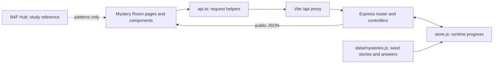
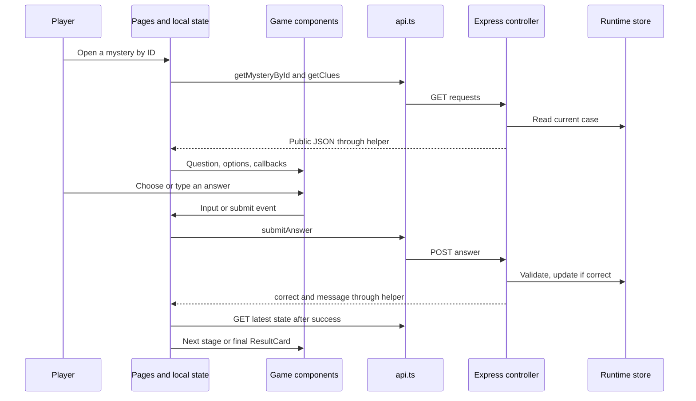

# Presentation Guide — Ali Mikdad

[Full team guide](PRESENTATION_GUIDE.md)

# 1. Project Overview

Mystery Room — The Case Archive is a browser game with two Arabic stories and an
English interface. Players choose a case, read clues, submit answers, and solve
three stages to unlock an ending.

B4F Hub is the bootcamp teaching project for community posts and opportunities.
Mystery Room applies its programming patterns to a different product. It does not
call Hub's services or share its data. Removing Mystery Room would not break Hub.

| Part | Current implementation |
| --- | --- |
| Frontend: the browser interface | React, TypeScript for code checking, React Router for navigation |
| Development tool | Vite serves the client and forwards /api requests to Express |
| Backend: the request-handling program | JavaScript runs in Node.js; Express maps requests to functions |
| API: the communication contract | GET reads data, POST submits answers, PATCH requests hints |
| Data format | JSON: text representing objects, arrays, and simple values |
| Database and ORM | None. An ORM is a database-mapping tool; we do not use one |
| Authentication: identity checking | None. There are no accounts, passwords, tokens, or login sessions |
| Runtime storage | One in-memory server store, shared by connected browsers |
| Persistence | Browser refresh keeps server progress; server restart resets it |

HTTP is the request/response protocol between client and server. A proxy forwards
requests: during development, Vite forwards /api to localhost:3001. Normal npm start
in server does not serve the React production bundle.



## Team responsibilities and evidence

This is a guide to the **current integrated working tree**, including uncommitted
changes. Your latest role list defines presentation responsibilities; it does not
prove who wrote every line. Shared-file authorship is not invented.

| Member | Presentation area | Important limit |
| --- | --- | --- |
| Shiam Ezzo | Pages, routes, and layout | AppRouter, AboutPage, and separate Header files are absent |
| Hassan Alloush | API helpers, public types, and feedback | Current files are flat api.ts/types.ts, not the proposed folders |
| Mulham Al Kasir (Molham) | Existing page-local state and game flow | Earlier page work exists; assigned Context/Redux files are absent |
| Adham Albasha | Game components and results | Supplied components were merged and adapted |
| Hamid Al Haj | First mystery and shared backend overview | First-case ownership is user-confirmed; shared-file split is unclear |
| Ali Mikdad | Second mystery and validation behavior | Second-case ownership is user-confirmed; shared-file split is unclear |

Shiam and Mulham discuss overlapping pages from different angles: navigation versus
state and requests. This is a speaking plan, not an exclusive authorship assignment.
Later integration fixes, tests, and new reveal text are not automatically credited
to the original puzzle authors.

# 2. Team Member Section

## Ali Mikdad – Second Mystery and Answer Validation

### 2.1 High-Level Summary

Ali is responsible for the second puzzle according to the team assignment. This case uses typed Arabic answers instead of multiple-choice options. The shared server accepts specified answer variants and enforces stage and hint rules. The guide also covers existing tests as evidence, without attributing their authorship to Ali.

### 2.2 Files They Worked On

These are the current files for this presentation area. Shared or comparison files
are not proof of individual authorship; missing assignments are noted below.

| File Path | Purpose | Key Functions/Classes/Components |
| --- | --- | --- |
| [server/data/mysteries.js](<../server/data/mysteries.js>) | Defines case 2 questions and accepted answer variants | initialMysteries, case id 2 |
| [server/controllers/mysteryController.js](<../server/controllers/mysteryController.js>) | Validates answers and enforces hint limits | submitAnswer, requestHint, toPublicMystery |
| [server/store.js](<../server/store.js>) | Finds cases and resets isolated test state | findMysteryById, resetMysteries |
| [server/tests/mysteries.test.js](<../server/tests/mysteries.test.js>) | Verifies real HTTP behavior against the app | Node test runner tests |
| [client/src/pages/GamePage.tsx](<../client/src/pages/GamePage.tsx>) | Shows the text input when options are empty | GameSession, handleSubmit |

### 2.3 Code Walkthrough

1. Case 2 has empty option arrays, so `GamePage` displays a text input. Its accepted answers include variants for the letter qaf, playing chess, and ten; see the data file for the exact lists.
2. The answer controller finds the requested mystery. Unknown IDs return 404.
3. It rejects missing, non-string, blank, or over-200-character answers with 400. Client constraints are helpful but do not replace this server check.
4. It trims the submitted text and converts letters to lowercase before comparing against a single accepted answer or a list. This is exact comparison after that normalization, not fuzzy matching or general Arabic spelling correction.
5. A wrong attempt returns 200 with `correct: false` and leaves the stage unchanged. A correct attempt advances the game, or marks the last stage solved. A valid further answer to a solved case returns 409.
6. Hint requests use one budget of three per case. Repeating a hint still consumes the budget; solved cases and exhausted budgets return 409.
7. Existing HTTP tests cover both complete cases, accepted aliases, privacy/reveals, invalid input, missing IDs, malformed JSON, unknown routes, and independent hint budgets. They use an isolated app listener and reset test data between tests.

The final stage index stays at the last zero-based index after solving; `solved` is the completion flag. Later integration adjusted wording and added ending text and tests, so distinguish puzzle ownership from those changes.

### 2.4 Key Concepts to Learn

**Validation.** Validation checks whether input follows required rules before changing data. It runs on the server because a caller can bypass browser controls.

**Normalization.** Normalization makes small deliberate formatting differences comparable. Here it means trimming surrounding spaces and lowercasing; other variants must be explicitly listed.

**HTTP response codes.** 400 signals invalid input, 404 a missing resource, and 409 a conflict with current state. A wrong puzzle guess is handled as an ordinary 200 response with a false correctness flag.

**Integration test.** An integration test checks several connected parts together. These tests send real HTTP requests to the app, so they exercise parsing, routing, controllers, and the store.

### 2.5 Connection to B4F Hub

Compare input guards and state conflicts in [Hub applyToOpportunity](<../../../B4F-BootCamp/b4f-cohort8-salamiyah-react-node-bootcamp-2026/server/controllers/opportunities.js>). Applying twice there and acting on a solved case here are examples of state conflicts. Mystery Room’s puzzle aliases and tests belong to this project, and removing them would not change Hub.

### 2.6 Connection to b4f-cohort8 Docs

- [Session 5 study guide](<../../../B4F-BootCamp/b4f-cohort8-salamiyah-react-node-bootcamp-2026/docs/Sessions/session-05/SESSION_GUIDE-EN.pdf>): Sections 5–8 explain request tracing and response handling.
- [Session 6 study guide](<../../../B4F-BootCamp/b4f-cohort8-salamiyah-react-node-bootcamp-2026/docs/Sessions/session-06/SESSION_GUIDE-EN.pdf>): Sections 3–4 cover body validation, early returns, and status codes; section 5 describes the shared state owner. Section 9 discusses error middleware, but our parser-error implementation is an integration addition.

### 2.7 Presentation Talking Points

- Start: “The second case accepts typed answers and checks them on the server.”
- Show one accepted-answer array, then the comparison in `submitAnswer`.
- Demonstrate an incorrect response and one listed Arabic/number variant.
- Run `npm test` from server if needed, explaining the tests are verification evidence.
- Avoid calling the answer check artificial intelligence or claiming it accepts every equivalent Arabic phrase.

### 2.8 Expected Questions & Answers

| Question | Simple Answer |
| --- | --- |
| Why allow answer arrays? | They explicitly list acceptable variants for the same solution. |
| Can a wrong guess advance the stage? | No. Only a correct answer changes progression. |
| Are three hints available for each stage? | No. The budget is three requests for the whole case. |
| Does typing 10 work for the final answer? | Yes, it is one of the listed variants, alongside ١٠ and other explicit aliases. |
| Who authored the tests? | They are current integration evidence; individual credit needs confirmation. |

### 2.9 Glossary for This Member

| Term | Meaning |
| --- | --- |
| Alias | An explicitly accepted alternative form of an answer. |
| Guard clause | An early check that returns before invalid work continues. |
| Conflict | An action incompatible with the current resource state. |
| Test isolation | Keeping test state separate from other runs or the live demo. |
| Normalization | A defined transformation before comparison. |

**Scope and attribution:** Case 2 ownership follows the user’s assignment. TODO: need confirmation — the shared controller split and credit for later wording, reveals, and tests. The test file is shown as evidence, not an authorship claim.

# 3. Cross-Team Integration

Shiam explains the screens and addresses. Mulham explains temporary page state.
Adham explains the display components. Hassan explains the API helpers and types.
Hamid and Ali explain the shared server and their respective stories.



B4F Hub is **outside** this runtime sequence. There are no shared imports, API
endpoints, database tables, or cross-project events. It provides the study examples.

| Boundary | Agreement |
| --- | --- |
| Page to component | Props: values/functions passed from parent to child |
| Component to page | Callbacks: functions called when the player acts |
| Page to API helper | Named functions, not fetch calls scattered through components |
| API to backend | JSON bodies and deliberate HTTP status codes |
| Backend to page | Zero-based currentStage, hintsRemaining, reveal:null until solved |
| Seed to runtime | One mutable store; accepted answers stay private |

Important differences from Hub: our missing-mystery helper throws rather than
returning null; seeds are deep-copied; Express setup is in app.js; basic JSON-parser
error handling was added during integration. Session 6 discusses error middleware
conceptually, but its Hub example did not implement that handler. Do not describe
our additions as exact code taught in that session.

# 4. Presentation Day Checklist

## Before the talk

- Open this guide, the project, and two terminals in server and client.
- Run npm install (or npm ci) separately in both directories before presentation day.
- Start server with npm start and client with npm run dev. Use Vite's printed URL.
- Do not start a second backend on an occupied port. The default API port is 3001.
- Restart the dedicated demo backend before a fresh demonstration; this clears progress.
- Check client npm run build, client npm run lint, and server npm test beforehand.
- Confirm each speaker's role and review story wording as a team.

## Suggested six-minute order

| Speaker | Time | Have open | Show |
| --- | --- | --- | --- |
| Hamid | 45 sec | Home and first-case data | Team, product, player goal |
| Shiam | 45 sec | App.tsx and browser | Home to archive to details; ID in URL |
| Mulham | 60 sec | GamePage.tsx | Input state, wrong attempt, server progression |
| Adham | 75 sec | AnswerOptions and ResultCard | Clue/hint controls; final reveal |
| Hassan | 60 sec | api.ts, types.ts, ErrorMessage | Request flow and recovery |
| Ali | 75 sec | Second-case data and tests | Free text, validation, challenge and improvement |

This is a proposed speaking order, not a claim of code authorship. The assignment
asks for a 5–7 minute English product presentation, not a reading of every file.

## Demo sequence

1. Start at Home and explain the player goal in one sentence.
2. Open case 1. Choose iron to demonstrate a wrong guess without progression.
3. Show clues and request one hint. Explain the three-request budget per case.
4. Solve the case, show the actual ending and statistics, and refresh the result.
5. Open case 2 to show the text-input branch if time allows.
6. Explain a real challenge: a server can accept an answer before its response is lost.
7. Explain the recovery: GET current progress before making another change.

<details>
<summary>Presenter answer key — spoilers</summary>

- Case 1: brass → 42 → 12.
- Case 2: قاف → يلعب الشطرنج → ١٠ (or 10).
- These are preparation notes, not answers embedded in the client.

</details>

## Backup plan

- If the interface or API fails, inspect the relevant terminal and show the recovery state honestly.
- If already solved, restart only the dedicated demo backend, not an unrelated process.
- Use previously captured screenshots or test output as backup, clearly labelled prior evidence.
- Run npm test in server to show independent API behavior. Its isolated process does not reset the live demo server.
- Avoid package upgrades or new installs during the talk.

Independent failure examples in PowerShell:

```powershell
Invoke-WebRequest http://localhost:3001/api/mysteries/1/answers -Method Post -ContentType 'application/json' -Body '{}'
curl.exe -i http://localhost:3001/api/mysteries/999
```

The first intentionally returns 400; the second returns 404. Neither solves a stage.

# 5. Final Notes

## Facts and limits

- The current source and supplied B4F reference files are the evidence for this guide.
- The project specification permits local state and does not require Redux or Context.
- Hamid's first-case and Ali's second-case ownership comes from the user's confirmation.
- A source folder named molham does not prove Molham authored every file inside it.
- Tests and browser checks recorded in CODE-WALKTHROUGH.md are previous verification evidence. This documentation-only task does not claim a fresh application test run.
- Contributions must be supported by actual work and history, not generated attribution.

## Open questions retained without blocking this draft

- **TODO: need confirmation** — will Shiam's AppRouter, Header, and About files arrive later, or are the current equivalents final?
- **TODO: need confirmation** — does Hassan have another api/types implementation, or are the flat modules the agreed version?
- **TODO: need confirmation** — is existing local-state/page work Mulham's final speaking topic, or will he supply Context/Redux files?
- **TODO: need confirmation** — how do Hamid and Ali divide the shared server files?
- **TODO: need confirmation** — who should receive credit for later reveal wording, integration fixes, and tests?
- **TODO: need confirmation** — confirm the speaking order, real Git contributions, and story originality as a team.
- **TODO: need confirmation** — PROJECT-SPEC-EN.pdf refers to PRESENTATION-GUIDE-EN.md, but that separate document was not found in the supplied docs. Timing here follows the specification's own sections 18–21.

No missing feature is presented as implemented. No database, authentication, theme
switch, language switch, game slice, or live Hub integration is claimed.

## Source index

- [Mystery Room setup](<../README.md>)
- [Current code recap and verification](<CODE-WALKTHROUGH.md>)
- [B4F Hub README](<../../../B4F-BootCamp/b4f-cohort8-salamiyah-react-node-bootcamp-2026/README.md>)
- [Session 1 study guide](<../../../B4F-BootCamp/b4f-cohort8-salamiyah-react-node-bootcamp-2026/docs/Sessions/session-01/SESSION_GUIDE-EN.pdf>)
- [Session 2 study guide](<../../../B4F-BootCamp/b4f-cohort8-salamiyah-react-node-bootcamp-2026/docs/Sessions/session-02/SESSION_GUIDE-EN.pdf>)
- [Session 3 study guide](<../../../B4F-BootCamp/b4f-cohort8-salamiyah-react-node-bootcamp-2026/docs/Sessions/session-03/SESSION_GUIDE-EN.pdf>)
- [Session 4 study guide](<../../../B4F-BootCamp/b4f-cohort8-salamiyah-react-node-bootcamp-2026/docs/Sessions/session-04/SESSION_GUIDE-EN.pdf>)
- [Session 5 study guide](<../../../B4F-BootCamp/b4f-cohort8-salamiyah-react-node-bootcamp-2026/docs/Sessions/session-05/SESSION_GUIDE-EN.pdf>)
- [Session 6 study guide](<../../../B4F-BootCamp/b4f-cohort8-salamiyah-react-node-bootcamp-2026/docs/Sessions/session-06/SESSION_GUIDE-EN.pdf>)
- [Project specification: sections 7–10, 13–17, 18–21](<../../../B4F-BootCamp/b4f-cohort8-salamiyah-react-node-bootcamp-2026/docs/Weekly Mini Projects/weekly-mini-project-01/PROJECT-SPEC-EN.pdf>)
- [Team division: Team 4 and teamwork rules](<../../../B4F-BootCamp/b4f-cohort8-salamiyah-react-node-bootcamp-2026/docs/Weekly Mini Projects/weekly-mini-project-01/Weekly_Mini_Project_01_Teams.pdf>)

Repository links are relative. Hub/PDF links target the supplied sibling bootcamp
folder; teammates with a different folder layout should update that reference path.
Section numbers in the explanations also let you locate PDF material manually.
