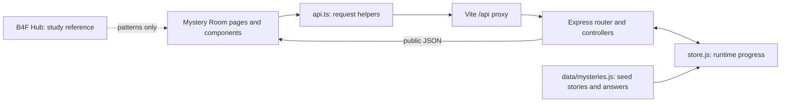
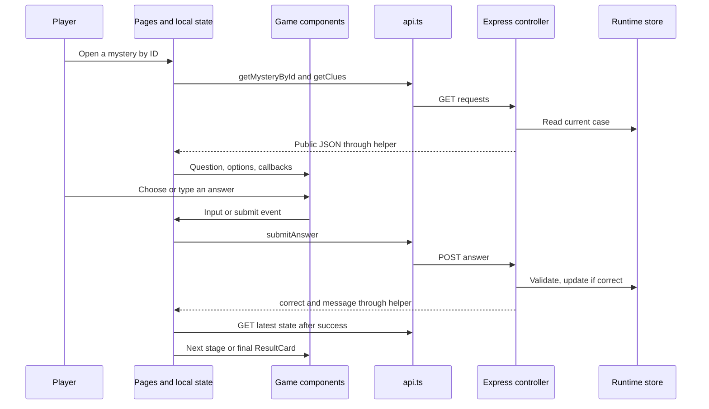

# Presentation Guide — Shiam Ezzo

[Full team guide](PRESENTATION_GUIDE.md)

# 1. Project Overview

Mystery Room — The Case Archive is a browser game with two Arabic stories and an
English interface. Players choose a case, read clues, submit answers, and solve
three stages to unlock an ending.

B4F Hub is the bootcamp teaching project for community posts and opportunities.
Mystery Room applies its programming patterns to a different product. It does not
call Hub's services or share its data. Removing Mystery Room would not break Hub.

| Part | Current implementation |
| --- | --- |
| Frontend: the browser interface | React, TypeScript for code checking, React Router for navigation |
| Development tool | Vite serves the client and forwards /api requests to Express |
| Backend: the request-handling program | JavaScript runs in Node.js; Express maps requests to functions |
| API: the communication contract | GET reads data, POST submits answers, PATCH requests hints |
| Data format | JSON: text representing objects, arrays, and simple values |
| Database and ORM | None. An ORM is a database-mapping tool; we do not use one |
| Authentication: identity checking | None. There are no accounts, passwords, tokens, or login sessions |
| Runtime storage | One in-memory server store, shared by connected browsers |
| Persistence | Browser refresh keeps server progress; server restart resets it |

HTTP is the request/response protocol between client and server. A proxy forwards
requests: during development, Vite forwards /api to localhost:3001. Normal npm start
in server does not serve the React production bundle.



## Team responsibilities and evidence

This is a guide to the **current integrated working tree**, including uncommitted
changes. Your latest role list defines presentation responsibilities; it does not
prove who wrote every line. Shared-file authorship is not invented.

| Member | Presentation area | Important limit |
| --- | --- | --- |
| Shiam Ezzo | Pages, routes, and layout | AppRouter, AboutPage, and separate Header files are absent |
| Hassan Alloush | API helpers, public types, and feedback | Current files are flat api.ts/types.ts, not the proposed folders |
| Mulham Al Kasir (Molham) | Existing page-local state and game flow | Earlier page work exists; assigned Context/Redux files are absent |
| Adham Albasha | Game components and results | Supplied components were merged and adapted |
| Hamid Al Haj | First mystery and shared backend overview | First-case ownership is user-confirmed; shared-file split is unclear |
| Ali Mikdad | Second mystery and validation behavior | Second-case ownership is user-confirmed; shared-file split is unclear |

Shiam and Mulham discuss overlapping pages from different angles: navigation versus
state and requests. This is a speaking plan, not an exclusive authorship assignment.
Later integration fixes, tests, and new reveal text are not automatically credited
to the original puzzle authors.

# 2. Team Member Section

## Shiam Ezzo – Pages, Routes, and Layout

### 2.1 High-Level Summary

This area gives the player a clear route through the application. Home introduces the game, the archive lists cases, and the details page prepares the player to start. Game and result pages handle the playing and ending screens. Shared navigation and a footer keep the layout consistent.

### 2.2 Files They Worked On

These are the current files for this presentation area. Shared or comparison files
are not proof of individual authorship; missing assignments are noted below.

| File Path | Purpose | Key Functions/Classes/Components |
| --- | --- | --- |
| [client/src/main.tsx](<../client/src/main.tsx>) | Starts React and browser routing | createRoot, BrowserRouter |
| [client/src/App.tsx](<../client/src/App.tsx>) | Connects URLs to pages and shared layout | App, Routes, Route |
| [client/src/pages/HomePage.tsx](<../client/src/pages/HomePage.tsx>) | Introduces the product | HomePage |
| [client/src/pages/MysteriesPage.tsx](<../client/src/pages/MysteriesPage.tsx>) | Lists available cases | MysteriesPage |
| [client/src/pages/MysteryDetailsPage.tsx](<../client/src/pages/MysteryDetailsPage.tsx>) | Loads a selected case and offers the next action | MysteryDetailsPage |
| [client/src/pages/GamePage.tsx](<../client/src/pages/GamePage.tsx>) | Hosts the playing interface | GamePage, GameSession |
| [client/src/pages/ResultPage.tsx](<../client/src/pages/ResultPage.tsx>) | Loads completion or continue state | ResultPage |
| [client/src/pages/NotFoundPage.tsx](<../client/src/pages/NotFoundPage.tsx>) | Handles unmatched URLs | NotFoundPage |
| [client/src/components/Navbar.tsx](<../client/src/components/Navbar.tsx>) | Shared navigation | Navbar |
| [client/src/components/Footer.tsx](<../client/src/components/Footer.tsx>) | Shared footer | Footer |

### 2.3 Code Walkthrough

1. `main.tsx` wraps the application in one `BrowserRouter`.
2. `App.tsx` places the shared layout around `Routes`. The routes are `/`, `/mysteries`, `/mysteries/:id`, `/mysteries/:id/play`, and `/result/:id`; `*` is the fallback.
3. A `Link` changes the address without a full document reload. The `:id` part selects the case.
4. Detail, game, and result pages read that ID and ask Hassan's helpers for current server data. They show loading and error states while data is unavailable.
5. The game page composes Adham's small components. A solved game navigates to the result route.
6. The result page fetches its own data, so opening it directly or refreshing it does not depend on a previous page's memory. An unfinished case offers continuation.

A missing case such as `/mysteries/999` is an API error inside the detail page. An unknown route is handled by `NotFoundPage`; these are different failures.

### 2.4 Key Concepts to Learn

**Route.** A route maps a URL to a screen. A dynamic segment such as `:id` lets one page support multiple cases.

**Component.** A React component is a reusable function that describes part of the interface. Pages are components with responsibility for a whole screen.

**Client-side navigation.** React Router changes the displayed page inside the running application. Links retain ordinary navigation meaning without reloading the whole document.

**Route parameter.** A route parameter is text extracted from the URL. The backend later converts the mystery ID to a number and checks whether the case exists.

### 2.5 Connection to B4F Hub

The layout follows the page-and-route approach in [Hub App.tsx](<../../../B4F-BootCamp/b4f-cohort8-salamiyah-react-node-bootcamp-2026/client/src/App.tsx>). Both projects use React Router, but their routes and page data are independent. Without this area, Mystery Room would lose its screen navigation; Hub itself would continue working.

### 2.6 Connection to b4f-cohort8 Docs

- [Session 1 study guide](<../../../B4F-BootCamp/b4f-cohort8-salamiyah-react-node-bootcamp-2026/docs/Sessions/session-01/SESSION_GUIDE-EN.pdf>): Sections 4–7 explain BrowserRouter, pages, Link, and NavLink; sections 9–12 cover parameters, unavailable data, and programmatic navigation.
- [Session 5 study guide](<../../../B4F-BootCamp/b4f-cohort8-salamiyah-react-node-bootcamp-2026/docs/Sessions/session-05/SESSION_GUIDE-EN.pdf>): Sections 8–9 connect an ID route to a backend request. Our helper reports missing records with an error rather than Hub’s null return.

### 2.7 Presentation Talking Points

- Start: “I organize the screens and connect each address to the correct page.”
- Show `App.tsx`, then navigate Home → archive → details → play.
- Point out the ID in the address and refresh a result page.
- Explain the difference between an unknown URL and a missing mystery.
- Avoid presenting an About page or separate Header/AppRouter file as implemented.

### 2.8 Expected Questions & Answers

| Question | Simple Answer |
| --- | --- |
| Why one BrowserRouter? | It supplies one routing context to the application, matching the bootcamp structure. |
| Why separate pages? | Each screen has a clear purpose and is easier to follow. |
| Who checks the answer? | The server. Pages collect input and display its response. |
| Can results survive refresh? | Yes, while the same backend process remains running; the page fetches its progress. |

### 2.9 Glossary for This Member

| Term | Meaning |
| --- | --- |
| URL | The address of a page or resource. |
| Layout | The shared arrangement around page content. |
| Parameter | A value supplied through an address or function call. |
| Fallback route | The route used when no other pattern matches. |

**Scope and attribution:** TODO: need confirmation — the assigned `pages/AboutPage.tsx`, `router/AppRouter.tsx`, and `components/Header.tsx` are absent. Existing routing is in App.tsx. Shared pages overlap with Mulham’s presentation area.

# 3. Cross-Team Integration

Shiam explains the screens and addresses. Mulham explains temporary page state.
Adham explains the display components. Hassan explains the API helpers and types.
Hamid and Ali explain the shared server and their respective stories.



B4F Hub is **outside** this runtime sequence. There are no shared imports, API
endpoints, database tables, or cross-project events. It provides the study examples.

| Boundary | Agreement |
| --- | --- |
| Page to component | Props: values/functions passed from parent to child |
| Component to page | Callbacks: functions called when the player acts |
| Page to API helper | Named functions, not fetch calls scattered through components |
| API to backend | JSON bodies and deliberate HTTP status codes |
| Backend to page | Zero-based currentStage, hintsRemaining, reveal:null until solved |
| Seed to runtime | One mutable store; accepted answers stay private |

Important differences from Hub: our missing-mystery helper throws rather than
returning null; seeds are deep-copied; Express setup is in app.js; basic JSON-parser
error handling was added during integration. Session 6 discusses error middleware
conceptually, but its Hub example did not implement that handler. Do not describe
our additions as exact code taught in that session.

# 4. Presentation Day Checklist

## Before the talk

- Open this guide, the project, and two terminals in server and client.
- Run npm install (or npm ci) separately in both directories before presentation day.
- Start server with npm start and client with npm run dev. Use Vite's printed URL.
- Do not start a second backend on an occupied port. The default API port is 3001.
- Restart the dedicated demo backend before a fresh demonstration; this clears progress.
- Check client npm run build, client npm run lint, and server npm test beforehand.
- Confirm each speaker's role and review story wording as a team.

## Suggested six-minute order

| Speaker | Time | Have open | Show |
| --- | --- | --- | --- |
| Hamid | 45 sec | Home and first-case data | Team, product, player goal |
| Shiam | 45 sec | App.tsx and browser | Home to archive to details; ID in URL |
| Mulham | 60 sec | GamePage.tsx | Input state, wrong attempt, server progression |
| Adham | 75 sec | AnswerOptions and ResultCard | Clue/hint controls; final reveal |
| Hassan | 60 sec | api.ts, types.ts, ErrorMessage | Request flow and recovery |
| Ali | 75 sec | Second-case data and tests | Free text, validation, challenge and improvement |

This is a proposed speaking order, not a claim of code authorship. The assignment
asks for a 5–7 minute English product presentation, not a reading of every file.

## Demo sequence

1. Start at Home and explain the player goal in one sentence.
2. Open case 1. Choose iron to demonstrate a wrong guess without progression.
3. Show clues and request one hint. Explain the three-request budget per case.
4. Solve the case, show the actual ending and statistics, and refresh the result.
5. Open case 2 to show the text-input branch if time allows.
6. Explain a real challenge: a server can accept an answer before its response is lost.
7. Explain the recovery: GET current progress before making another change.

<details>
<summary>Presenter answer key — spoilers</summary>

- Case 1: brass → 42 → 12.
- Case 2: قاف → يلعب الشطرنج → ١٠ (or 10).
- These are preparation notes, not answers embedded in the client.

</details>

## Backup plan

- If the interface or API fails, inspect the relevant terminal and show the recovery state honestly.
- If already solved, restart only the dedicated demo backend, not an unrelated process.
- Use previously captured screenshots or test output as backup, clearly labelled prior evidence.
- Run npm test in server to show independent API behavior. Its isolated process does not reset the live demo server.
- Avoid package upgrades or new installs during the talk.

Independent failure examples in PowerShell:

```powershell
Invoke-WebRequest http://localhost:3001/api/mysteries/1/answers -Method Post -ContentType 'application/json' -Body '{}'
curl.exe -i http://localhost:3001/api/mysteries/999
```

The first intentionally returns 400; the second returns 404. Neither solves a stage.

# 5. Final Notes

## Facts and limits

- The current source and supplied B4F reference files are the evidence for this guide.
- The project specification permits local state and does not require Redux or Context.
- Hamid's first-case and Ali's second-case ownership comes from the user's confirmation.
- A source folder named molham does not prove Molham authored every file inside it.
- Tests and browser checks recorded in CODE-WALKTHROUGH.md are previous verification evidence. This documentation-only task does not claim a fresh application test run.
- Contributions must be supported by actual work and history, not generated attribution.

## Open questions retained without blocking this draft

- **TODO: need confirmation** — will Shiam's AppRouter, Header, and About files arrive later, or are the current equivalents final?
- **TODO: need confirmation** — does Hassan have another api/types implementation, or are the flat modules the agreed version?
- **TODO: need confirmation** — is existing local-state/page work Mulham's final speaking topic, or will he supply Context/Redux files?
- **TODO: need confirmation** — how do Hamid and Ali divide the shared server files?
- **TODO: need confirmation** — who should receive credit for later reveal wording, integration fixes, and tests?
- **TODO: need confirmation** — confirm the speaking order, real Git contributions, and story originality as a team.
- **TODO: need confirmation** — PROJECT-SPEC-EN.pdf refers to PRESENTATION-GUIDE-EN.md, but that separate document was not found in the supplied docs. Timing here follows the specification's own sections 18–21.

No missing feature is presented as implemented. No database, authentication, theme
switch, language switch, game slice, or live Hub integration is claimed.

## Source index

- [Mystery Room setup](<../README.md>)
- [Current code recap and verification](<CODE-WALKTHROUGH.md>)
- [B4F Hub README](<../../../B4F-BootCamp/b4f-cohort8-salamiyah-react-node-bootcamp-2026/README.md>)
- [Session 1 study guide](<../../../B4F-BootCamp/b4f-cohort8-salamiyah-react-node-bootcamp-2026/docs/Sessions/session-01/SESSION_GUIDE-EN.pdf>)
- [Session 2 study guide](<../../../B4F-BootCamp/b4f-cohort8-salamiyah-react-node-bootcamp-2026/docs/Sessions/session-02/SESSION_GUIDE-EN.pdf>)
- [Session 3 study guide](<../../../B4F-BootCamp/b4f-cohort8-salamiyah-react-node-bootcamp-2026/docs/Sessions/session-03/SESSION_GUIDE-EN.pdf>)
- [Session 4 study guide](<../../../B4F-BootCamp/b4f-cohort8-salamiyah-react-node-bootcamp-2026/docs/Sessions/session-04/SESSION_GUIDE-EN.pdf>)
- [Session 5 study guide](<../../../B4F-BootCamp/b4f-cohort8-salamiyah-react-node-bootcamp-2026/docs/Sessions/session-05/SESSION_GUIDE-EN.pdf>)
- [Session 6 study guide](<../../../B4F-BootCamp/b4f-cohort8-salamiyah-react-node-bootcamp-2026/docs/Sessions/session-06/SESSION_GUIDE-EN.pdf>)
- [Project specification: sections 7–10, 13–17, 18–21](<../../../B4F-BootCamp/b4f-cohort8-salamiyah-react-node-bootcamp-2026/docs/Weekly Mini Projects/weekly-mini-project-01/PROJECT-SPEC-EN.pdf>)
- [Team division: Team 4 and teamwork rules](<../../../B4F-BootCamp/b4f-cohort8-salamiyah-react-node-bootcamp-2026/docs/Weekly Mini Projects/weekly-mini-project-01/Weekly_Mini_Project_01_Teams.pdf>)

Repository links are relative. Hub/PDF links target the supplied sibling bootcamp
folder; teammates with a different folder layout should update that reference path.
Section numbers in the explanations also let you locate PDF material manually.
